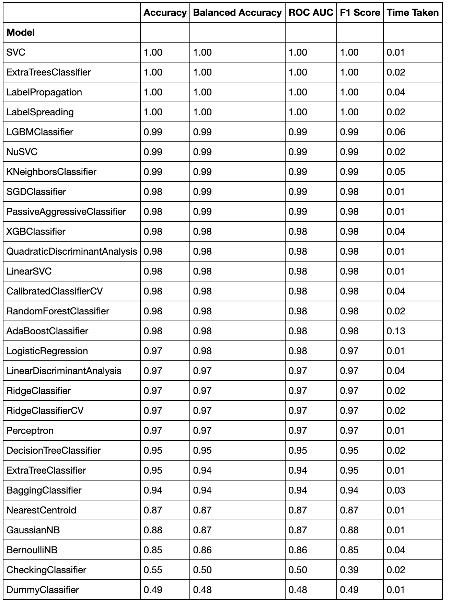

# Preventing fraud by spotting fake currency.

## Basic Overview:

* **Goal**: Create a model that helps banks in preventing fraud to spot fake currency.

* The cost of counterfit currency circulating in our economy has devastating affects that cab disfigure the economic aparatus. Banks are on the frontlines to help the governemnt in making sure the economy is operating flawlessly. This effort by humans alone is not possible.

* Therefore, this project uses data acquisition, cleaning, and algorithm testing to construct a model that helps banks detect fake currency.

## Resources and code used:

* ***Python Version***: 3.8
* ***Packages***: Pandas, Matplotlib, NumPy, Pickle, Sklearn (Decision Tree, RandomForest, train_test_split), LazyPredict, Flassger
* ***Data Source***: UCI: Bank Note Authentication

## Data Acquisition:

* Used UCI's dataset on Bank Note Authentication.
* Data were extracted from images that were taken from genuine and forged banknote-like specimens. For digitization, an industrial camera usually used for print inspection was used. The final images have 400x 400 pixels. Due to the object lens and distance to the investigated object gray-scale pictures with a resolution of about 660 dpi were gained. Wavelet Transform tool were used to extract features from images.
* Original data consists of about 12500 rows and 5 columns.

## Data Cleaning:

  ### Attribute Selection & data preperation:
    
    * The dataset did not have any outliers when boxplots were constructed (inter-quartile-range presentation).
    * Therefore, the raw dataset was fine to further construct the model.
    

## Model Building:

* Using LazyPredict library we were able to get an overview of how all the algorithms perform with the given dataset. The following is the outcome:

* 

## Conclusion:

* Linear Regression was selected as the ultimate choice for model building. Linear Regression's score and cross validation on test data gave stronger results compared to the other algorithms tested.

## Model Deployment:

* With the help of Pickle library the model was exported as an API.
* Using Flask a server was created to onboard the API and serve an interactable webpage that lets users input the location, bedrooms and bathroom to get the price prediction:

### The file with detailed step-by-step code is [here](/Price_Prediction_of_homes.ipynb).
